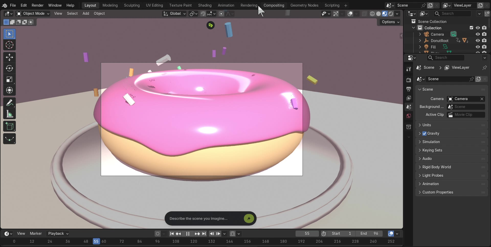
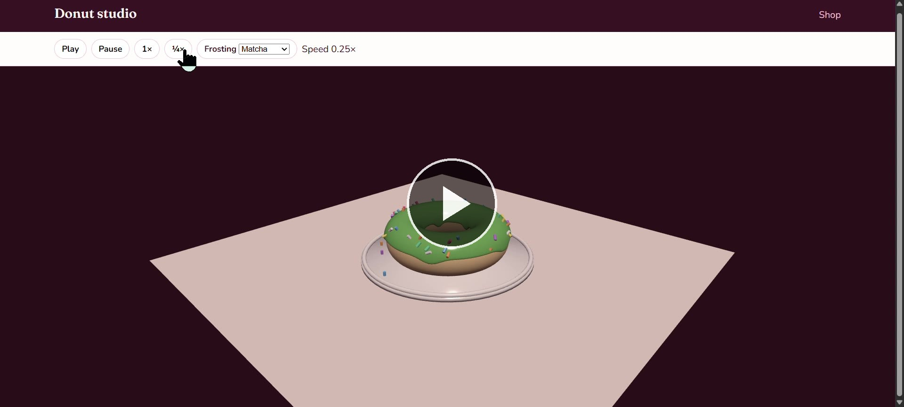

# Cursor × Blender animation demo

A small public demo of **Cursor as an agent**: it read a YouTube transcript, drove a local Blender 5.2 session, built and animated a scene, exported a GLB, then shipped an interactive website — without a human modeling in Blender.

This repository exists to make that loop inspectable. The 3D and the HTML are the artifacts; the interesting part is how they were produced.

The live site is a **pepperoni pizza** with pineapple chunks that fall under rigid-body gravity and bounce on the plate. The first pass was a pink-frosted donut; same agent loop, swapped toppings.

**Inspiration:** [The BEST Way to Build an App with ChatGPT-6 Astra](https://www.youtube.com/watch?v=vr_iCHPY8yI) (a walkthrough of connecting an AI agent to Blender, then putting the asset on a donut-shop page). This project follows that outline on **Cursor**, not ChatGPT Desktop.

**Who built it:** Cursor, end to end, using **Cursor Grok 4.6**. A human pointed at the transcript and later asked for this README and GitHub repo. Everything between — Blender MCP setup, modeling, animation, exports, the shop, browser checks — was the agent.

**Live site:** [Pizza shop](https://az9713.github.io/cursor-blender-animation-demo/) · [Studio](https://az9713.github.io/cursor-blender-animation-demo/web/studio.html)

## Click a still to play

GitHub’s file viewer does not play committed MP4s, so the stills open GitHub Pages players instead.

<table>
  <tr>
    <td align="center" valign="top" width="50%">
      <a href="https://az9713.github.io/cursor-blender-animation-demo/play/blender.html">
        
      </a>
      <br />
      <strong>Blender 5.2</strong> — drop, squash, sprinkle rain<br />
      <a href="https://az9713.github.io/cursor-blender-animation-demo/play/blender.html">▶ Play</a>
    </td>
    <td align="center" valign="top" width="50%">
      <a href="https://az9713.github.io/cursor-blender-animation-demo/play/web.html">
        
      </a>
      <br />
      <strong>Website</strong> — orbit, play/pause, frosting flavors<br />
      <a href="https://az9713.github.io/cursor-blender-animation-demo/play/web.html">▶ Play</a>
    </td>
  </tr>
</table>

## What the agent actually did

The source of truth was a pasted video transcript, not a finished spec. The agent extracted the same deliverables the video demonstrates, then ran the loop again with a pepperoni pizza and pineapple chunks:

1. A pizza with crust, marinara, cheese, and pepperoni
2. An animation: the pizza falls onto a plate, squish-wobbles, then pineapple chunks fall with rigid-body bounce
3. An MP4 of that animation
4. An interactive `index.html` (rotate, zoom, play/pause)
5. A branded pizza shop whose scroll position drives the same clip

Then it executed that list against a real Blender install.

### 1. Read the transcript

It treated the transcript as a product brief: four stacks of work (model, motion, export, web), plus the “practical” shop example at the end. Sponsor segments were ignored.

### 2. Talk to Blender, not to a render farm

Cursor already had a Blender MCP client. Blender itself was not listening. The agent installed the matching addon into Blender 5.2’s user addons folder, launched the GUI, started the TCP bridge, and only then ran scene Python.

That is the important split: the LLM never “drew” polygons in chat. It wrote `bpy` that ran **inside** the live Blender process, then looked at viewport screenshots and corrected the scene.

### 3. Model, look, fix, repeat

First pass: torus donut, icing, sprinkles. Second pass: disc dough, puffy crust, marinara, cheese, eighteen pepperoni. Viewport screenshots were the test, not coordinates.

### 4. Animate on the timeline

The pizza parent empty is keyed to fall and squash (roughly frames 1–36). Pineapple chunks stay kinematic in the air until after the landing, then Blender’s rigid-body world takes over — gravity, plate collision, restitution so they bounce, then sleep. That bake is what the GLB plays.

### 5. Export for people and for the browser

- `pizza.blend` — current authoring scene
- `export/pizza.glb` — meshes + baked clips for Three.js
- EEVEE PNG frames → H.264 when the renderer’s FFMPEG enum is unavailable

GLB export strips cameras and lights so the web viewer does not double-light the pie.

### 6. Put the same asset on a page

Two HTML surfaces share one GLB:

| Page | Job |
| --- | --- |
| `web/index.html` | Shop. Scroll scrubs the drop. Four sauces recolor live. |
| `web/studio.html` | Sandbox. Orbit, zoom, play/pause, 1× / ¼×. |

Three.js r160 no longer hangs `OrbitControls` on the global `THREE` object. The first studio load failed; the agent switched to ES modules + an import map after reading the error in the page.

AnimationMixer `setTime` on a paused clip did not pose the mesh. Play/pause in the running loop did. The shop therefore scrubs by advancing the mixer, then pausing.

### 7. Verify like a user

The agent opened the pages in a real browser, clicked Play, changed sauce to pesto, and scrolled the shop until the HUD read that the pineapple had settled. A screenshot of a canvas is not that check.

## Run it locally

Blender (optional): open `pizza.blend`, camera view, spacebar.

Website:

```bash
python -m http.server 8080
```

Then [http://localhost:8080/web/](http://localhost:8080/web/). A `file://` open will not load the GLB.

Rebuild the scene (Blender 5.2 on `PATH`):

```bash
blender pizza.blend --python scripts/build_pizza.py
```

## Layout

```
pizza.blend              current authoring file (pepperoni + bouncing pineapple)
donut.blend              first-pass donut scene
scripts/build_pizza.py   procedural pizza + rigid-body pineapple
scripts/build_donut.py   original donut builder
scripts/start_mcp.py     enable Blender MCP and listen
scripts/render_video.py  EEVEE stills / movie
export/pizza.glb         live web mesh + clips
export/donut.glb         first-pass mesh
export/preview.png       EEVEE still
web/                     shop + studio
media/                   compressed recordings + posters
```

The original 1080p screen recordings were about 11 MB and 20 MB. The copies in `media/` are 1280-wide H.264 (about 400 KB and 230 KB).

## What this does *not* prove

It does not replace a rigger or a lookdev artist. The pizza is primitives, keyframes, and a baked rigid-body rain. The value on show is the **closed loop**: transcript → local DCC via MCP → screenshot critique → export → interactive HTML → browser proof — in one agent session, in Cursor.

## License

Assets and code in this repo are for demonstration. The inspiration video is not affiliated with this repository.
